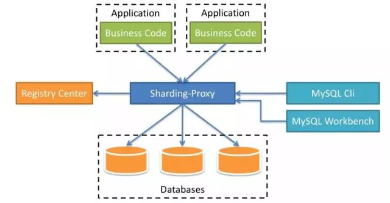

  <h1 align="center">Shardingproxy 数据库代理</h1>
  

    <a href="README.md"><strong>English</strong></a> | <strong>简体中文</strong>
  

## 目录

- [仓库简介](#项目介绍)
- [前置条件](#前置条件)
- [镜像说明](#镜像说明)
- [获取帮助](#获取帮助)
- [如何贡献](#如何贡献)

## 项目介绍
[ShardingProxy](https://github.com/apache/shardingsphere) 是一个透明的数据库代理，支持分片、读写分离等特性，为应用提供与单机数据库相同的访问体验。

ShardingProxy 的核心特性包括：

1. **透明分片**：应用无需感知分库分表逻辑，像访问单库一样操作分布式数据库。
2. **SQL兼容**：支持 MySQL/PostgreSQL 协议，兼容常用 SQL 语法（如 JOIN、子查询）。
3. **读写分离**：自动路由读写操作到主库或从库，提升查询性能。
4. **分布式事务**：支持 XA 和柔性事务（如 SAGA），保障跨分片数据一致性。
5. **弹性伸缩**：动态加载配置，支持在线扩缩容分片节点。
6. **多租户**：通过逻辑 Schema 隔离不同业务的数据访问。
7. **安全管控**：提供权限控制、SQL 审计、流量限制等治理能力。

**定位**：作为轻量级数据库中间件，简化分库分表架构的运维复杂度，适合替代传统 JDBC 直连方案。

本项目提供的开源镜像商品 [**`Shardingproxy-数据库代理`**](https://marketplace.huaweicloud.com/hidden/contents/9e9217e1-5c9d-4026-96bd-b3395d0c9aa8#productid=OFFI1131118959554052096)，已预先安装 Shardingproxy 软件及其相关运行环境，并提供部署模板。快来参照使用指南，轻松开启“开箱即用”的高效体验吧。

**架构设计：**

> **系统要求如下：**
> - CPU: 2vCPUs 或更高
> - RAM: 4GB 或更大
> - Disk: 至少 50GB

## 前置条件
[注册华为账号并开通华为云](https://support.huaweicloud.com/usermanual-account/account_id_001.html)

## 镜像说明

| 镜像规格                                                                                                                                              | 特性说明 | 备注 |
|---------------------------------------------------------------------------------------------------------------------------------------------------| --- | --- |
| [shardingproxy5.5.2](https://marketplace.huaweicloud.com/hidden/contents/9e9217e1-5c9d-4026-96bd-b3395d0c9aa8#productid=OFFI1131118959554052096) | 基于鲲鹏服务器 + Huawei Cloud EulerOS 2.0 64bit 安装部署 |  |

## 获取帮助
- 更多问题可通过 [issue](https://github.com/HuaweiCloudDeveloper/shardingproxy-image/issues) 或 华为云云商店指定商品的服务支持 与我们取得联系
- 其他开源镜像可看 [open-source-image-repos](https://github.com/HuaweiCloudDeveloper/open-source-image-repos)

## 如何贡献
- Fork 此存储库并提交合并请求
- 基于您的开源镜像信息同步更新 README.md